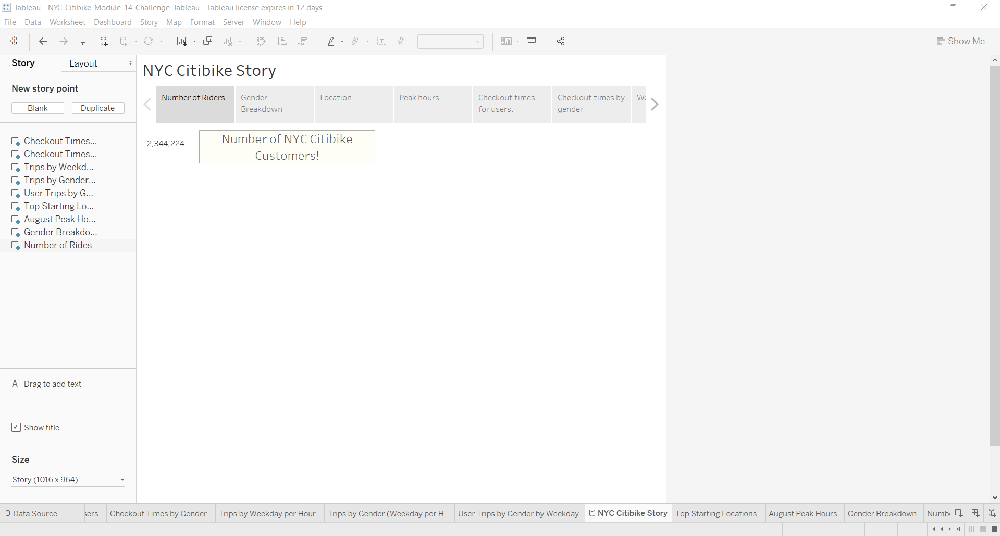
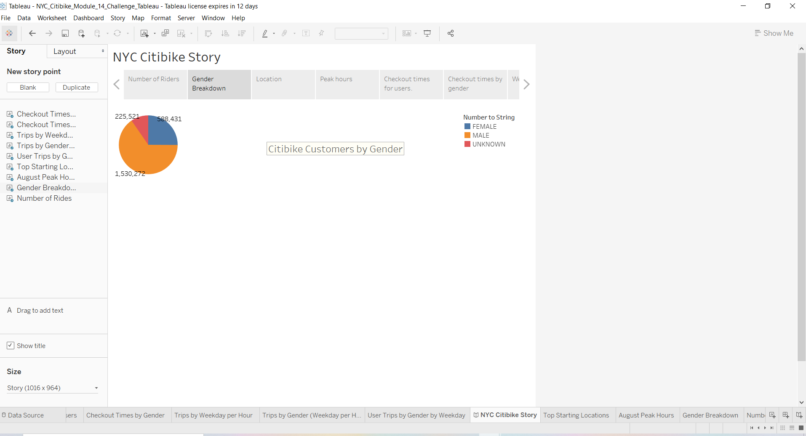
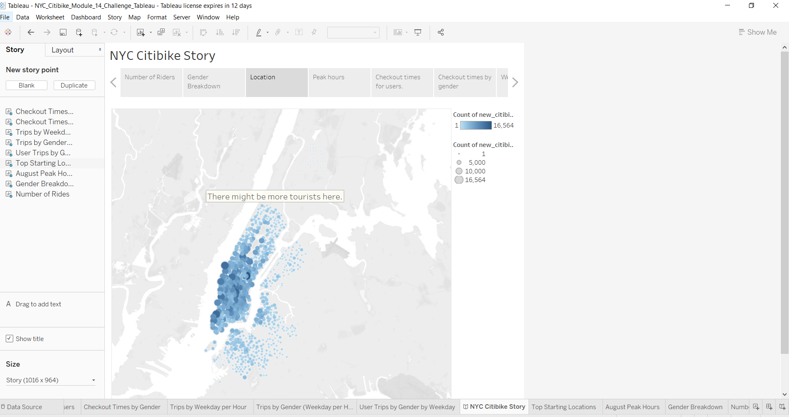
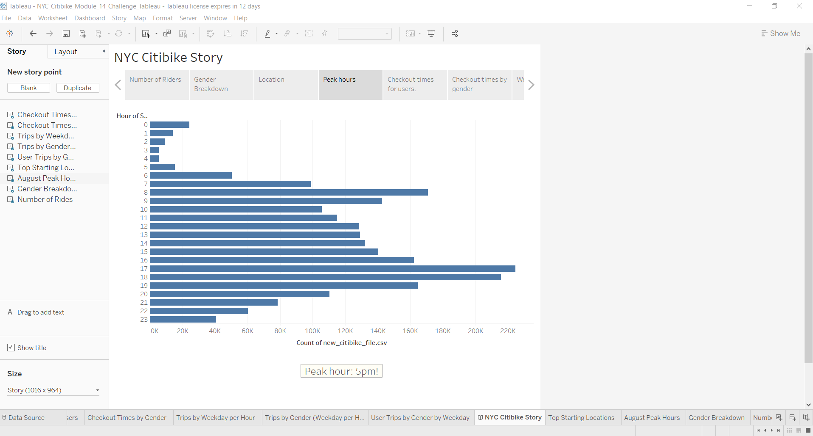
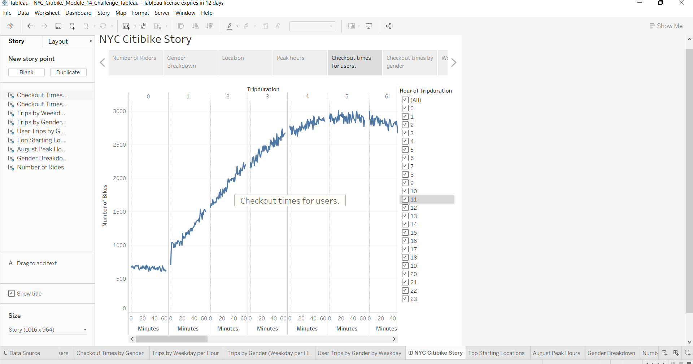
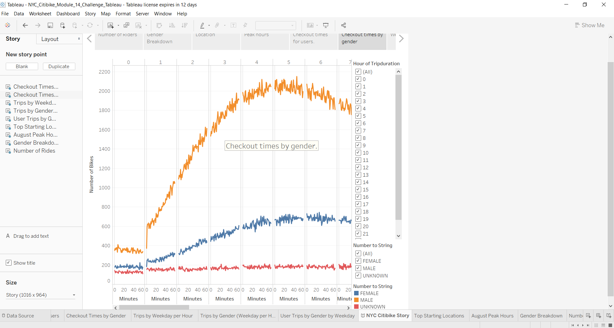
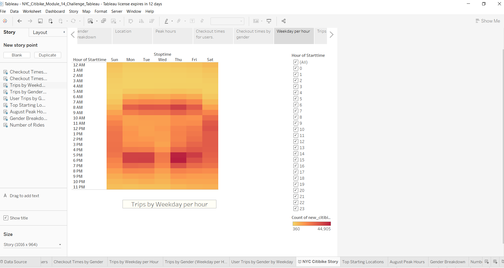
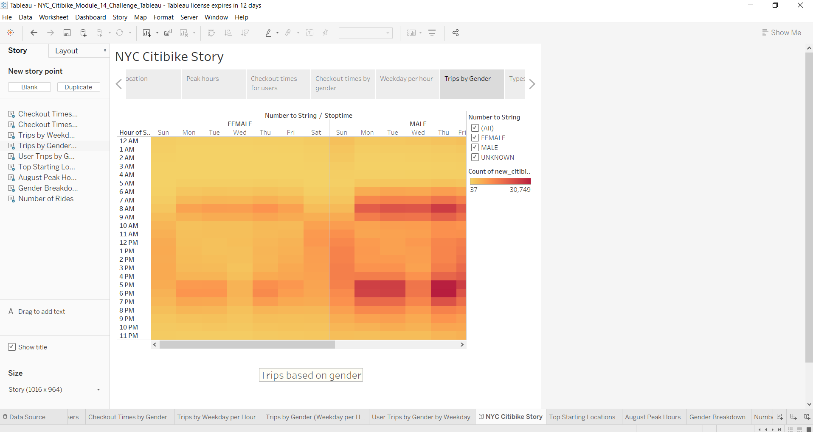
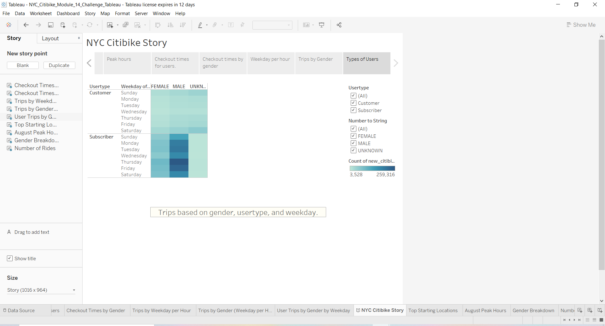

# bikesharing

# Overview of the analysis

The purpose of this analysis is to analyze NYC Citibike Data for the month of August to determine if a bike-sharing program will be feasible in Des Moines, Iowa. 

# Results 

## A description of each Tableau visualization is provided:

This image states the total number of NYC Citibike users.

This image provides the gender breakdown of all NYC Citibike users; whether male, female or unknown.

This map shows the locations of popular NYC Citibike starting points. The highest saturation of color shows the highest population density of that starting point.

This image shows the number of users based on timing by the hour. The busiest hour is at 5pm!

This image shows the checkout times for users by the hour and by the minute.

This image shows the checkout times for users by the hour and by the minute and by gender.

This heatmap shows the number of trips based on weekdays by the hour.

This heatmap shows the number of trips based on gender and weekdays and by the hour.

This image shows the number of trips based on the type of user (customer vs. subscriber), weekdays and gender.

# Summary

The data visualizations presented via Tableau indicate that a bike-sharing program in Des Moines, Iowa might be feasible. Although the population is smaller than compared to NYC, there are enough attractions in the city that tourists can choose to bike to for a more scenic and faster-than-walking solution.

## Two additional visualization suggestions to perform include:
- Comparison of age vs. starting and ending locations using area charts.
- A Gantt Bar to compare birth year (age) vs. gender (male, female, unknown) to gain an understanding of the population demographic.

[link to dashboard](https://prod-useast-b.online.tableau.com/t/stacychandisingh/views/NYC_Citibike_Module_14_Challenge_Tableau/NumberofRides?:showAppBanner=false&:display_count=n&:showVizHome=n&:origin=viz_share_link)

[link to dashboard1](https://prod-useast-b.online.tableau.com/#/site/stacychandisingh/projects/22358)
